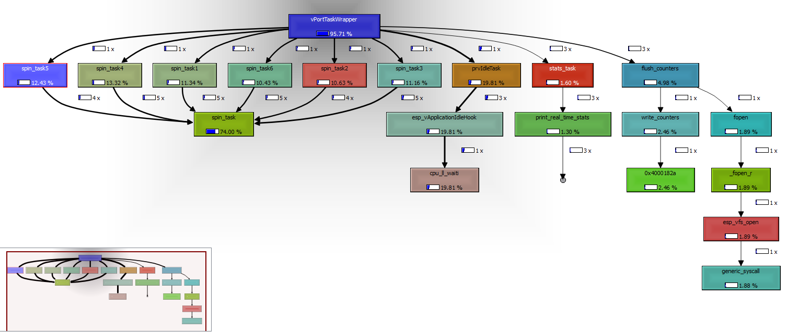

# ESP32 Semihosting Profiler

This profiler is base on the stack-sampling or callgraph profiler principles, it works by creating a timer interrupt that samples the stack and cumulative samples, it then flushes all the statistics on the semihosting pipe to sprof.out file.

The results are then processed by sprofiler.py script and generate a summary on the console and [CallGrind](https://kcachegrind.github.io/html/CallgrindFormat.html) output where the results can be graphically analyzed.


## How to Profile Your Code?
- Copy sprofiler library to your code
- Add profiler initialization code when you'd like to start profiling:
```c
#include <sprofiler.h>

void app_main(){
    sprofiler_initialize(100);
    ...
}
```
- Define a debugging environment in platformio.ini and include the analyzer script
```ini
; debug build
build_type = debug
; set breakpoint at the start of the application, modify for your use or remove completely
debug_init_break = tbreak app_main
; using esp-prog jtag probe, also works with jlink
debug_tool = esp-prog
; ggdb includes debugging symbols
build_flags = -DDEBUG -ggdb 
; adjust according to your connectivity quality between the probe and the esp32
debug_speed = 5000
; adjust to your environment
upload_port = COM4
; include profiler analysis script
extra_scripts = 
    scripts/sprofiler.py
```
- Compile in debug mode and upload
```bash
$ pio run -e debug -t upload
```
- Start debugging session to allow the semihosting connection
the profiler will fill 4 buffers and flushes them in turn, you should adjust `PROFILING_ITEMS_PER_BANK` according to your configuration to calculate the optimal size it should be:
PROFILING_ITEMS_PER_BANK = maximum stack depth * different branches
where different branches can be the number of tasks running in the system
If you seem to miss samples you can increase that value.
- Stop debugging session so the `sprof.out` file will be flushed
- Run analyzer to generate report and `callgrind.sprof` file
The results are as follows:
Caller Function, from filename:line -> Callee Function, from filename:line : number of captures, number of cycles, number of instructions
Where the number of cycles and instructions are from [xtensa performance counters](https://docs.espressif.com/projects/esp-idf/en/latest/esp32/api-reference/system/perfmon.html).
The function names that are specified as hex addresses (i.e. `0x4000bd83 ??:0`) are ROM functions, it is possible to decode which function it is by going through the ROM functions, for example in ESP32, you can look up the functions in the [ld folder](https://github.com/espressif/esp-idf/tree/master/components/esp_rom/esp32/ld) or use the [ROM ELFs](https://github.com/espressif/esp-rom-elfs/releases) from Espressif.
```bash
$ pio run -e debug -t analyze
Analysing sprof.out
Pointer Size:  4
Samples Per Bank:  100
Samples Per Second:  100
Cores:  2
Resolving Symbols...
prvIdleTask tasks.c:3973  -> esp_vApplicationIdleHook freertos_hooks.c:63 : 783 307926512 76424201
vPortTaskWrapper port.c:131 -> prvIdleTask tasks.c:3973  : 783 307926512 76424201
esp_vApplicationIdleHook freertos_hooks.c:63 -> cpu_ll_waiti cpu_ll.h:183 : 781 307926512 76424201
vPortTaskWrapper port.c:131 -> spin_task4 real_time_stats_example_main.c:163 : 206 70213898 30992208
vPortTaskWrapper port.c:131 -> spin_task1 real_time_stats_example_main.c:151 : 204 70204906 31215652
vPortTaskWrapper port.c:131 -> spin_task5 real_time_stats_example_main.c:167 : 202 86176568 34547921
vPortTaskWrapper port.c:131 -> spin_task2 real_time_stats_example_main.c:155 : 201 97310444 38941256
vPortTaskWrapper port.c:131 -> spin_task6 real_time_stats_example_main.c:171 : 201 89345478 35511218
vPortTaskWrapper port.c:131 -> spin_task3 real_time_stats_example_main.c:159 : 201 68584391 30480011
spin_task4 real_time_stats_example_main.c:163 -> spin_task real_time_stats_example_main.c:143 : 134 62236086 27673084
spin_task5 real_time_stats_example_main.c:167 -> spin_task real_time_stats_example_main.c:143 : 109 73409224 29098746
spin_task6 real_time_stats_example_main.c:171 -> spin_task real_time_stats_example_main.c:143 : 106 35104758 13218557
spin_task1 real_time_stats_example_main.c:151 -> spin_task real_time_stats_example_main.c:143 : 93 38284506 17022760
spin_task2 real_time_stats_example_main.c:155 -> spin_task real_time_stats_example_main.c:143  : 86 27135952 11265484
spin_task3 real_time_stats_example_main.c:159 -> spin_task real_time_stats_example_main.c:143 : 75 35120496 15615464
spin_task2 real_time_stats_example_main.c:155 -> spin_task real_time_stats_example_main.c:143 : 71 38262822 14627368
spin_task3 real_time_stats_example_main.c:159 -> spin_task real_time_stats_example_main.c:143  : 71 22333664 9930308
spin_task5 real_time_stats_example_main.c:167 -> spin_task real_time_stats_example_main.c:143  : 67 7980350 3549496
spin_task1 real_time_stats_example_main.c:151 -> spin_task real_time_stats_example_main.c:143  : 59 31920400 14192892
spin_task4 real_time_stats_example_main.c:163 -> spin_task real_time_stats_example_main.c:143  : 52 4787466 1900216
spin_task1 real_time_stats_example_main.c:151 -> spin_task real_time_stats_example_main.c:143 : 43 20718448 9098084
spin_task3 real_time_stats_example_main.c:159 -> spin_task real_time_stats_example_main.c:144  : 38 30330086 13485758
spin_task6 real_time_stats_example_main.c:171 -> spin_task real_time_stats_example_main.c:144  : 36 25531520 9527669
spin_task6 real_time_stats_example_main.c:171 -> spin_task real_time_stats_example_main.c:143 : 35 25517590 11345944
spin_task2 real_time_stats_example_main.c:155 -> spin_task real_time_stats_example_main.c:144  : 32 15957216 5954540
spin_task6 real_time_stats_example_main.c:171 -> spin_task real_time_stats_example_main.c:143  : 24 3191610 1419048
spin_task3 real_time_stats_example_main.c:159 -> spin_task real_time_stats_example_main.c:143 : 17 11130231 4934239
spin_task4 real_time_stats_example_main.c:163 -> spin_task real_time_stats_example_main.c:144  : 16 25527296 11350284
spin_task5 real_time_stats_example_main.c:167 -> spin_task real_time_stats_example_main.c:144  : 15 3191442 1190244
spin_task2 real_time_stats_example_main.c:155 -> spin_task real_time_stats_example_main.c:143 : 12 15954454 7093864
spin_task5 real_time_stats_example_main.c:167 -> spin_task real_time_stats_example_main.c:143 : 11 1595552 709435
esp_vfs_write vfs.c:431  -> console_write vfs_console.c:73 : 11 6300933 2428787
0x4000bd83 ??:0 -> esp_vfs_write vfs.c:431  : 11 6300933 2428787
0x4000117d ??:0 -> 0x4000bd83 ??:0 : 11 6300933 2428787
0x400592fe ??:0 -> 0x4000117d ??:0 : 11 6300933 2428787
0x4005937a ??:0 -> 0x400592fe ??:0 : 11 6300933 2428787
0x40058bbf ??:0 -> 0x4005937a ??:0 : 11 6300933 2428787
vPortTaskWrapper port.c:131 -> stats_task real_time_stats_example_main.c:187 : 8 3192674 1218903
spin_task1 real_time_stats_example_main.c:151 -> spin_task real_time_stats_example_main.c:144  : 8 12780800 5682776
console_write vfs_console.c:73 -> uart_write vfs_uart.c:209 : 7 6300933 2428787
__sprint_r vfprintf.c:433 -> 0x40058bbf ??:0 : 7 3192674 1218903
0x4000bd83 ??:0 -> esp_vfs_write vfs.c:431  : 6 8133102 7270
0x4000182a ??:0 -> 0x4000bd83 ??:0 : 6 8133102 7270
_vfprintf_r vfprintf.c:1781  -> __sprint_r vfprintf.c:433 : 5 3192674 1218903
printf printf.c:56  -> _vfprintf_r vfprintf.c:1781  : 5 3192674 1218903
print_real_time_stats real_time_stats_example_main.c:115 -> printf printf.c:56  : 5 3192674 1218903
stats_task real_time_stats_example_main.c:187 -> print_real_time_stats real_time_stats_example_main.c:115 : 5 3192674 1218903
spin_task4 real_time_stats_example_main.c:163 -> spin_task real_time_stats_example_main.c:143 : 4 3190346 1418908
_puts_r puts.c:91 -> 0x40058bbf ??:0 : 4 3108259 1209884
puts puts.c:129 -> _puts_r puts.c:91 : 4 3108259 1209884
stats_task real_time_stats_example_main.c:188 -> puts puts.c:129 : 4 3108259 1209884
vPortTaskWrapper port.c:131 -> stats_task real_time_stats_example_main.c:188 : 4 3108259 1209884
write_counters sprofiler.c:204 -> 0x4000182a ??:0 : 4 34427916 8134
flush_counters sprofiler.c:229  -> write_counters sprofiler.c:204 : 4 34427916 8134
vPortTaskWrapper port.c:131 -> flush_counters sprofiler.c:229  : 4 34427916 8134
esp_vfs_write vfs.c:431  -> generic_syscall vfs_semihost.c:124 : 3 8132173 6781
esp_vfs_write vfs.c:431  -> timer_isr_default timer.c:219 : 3 929 489
vPortClearInterruptMaskFromISR portmacro.h:571 -> 0x4000bfed ??:0 : 3 5241146 2383924
uxTaskGetSystemState tasks.c:2909 -> vPortClearInterruptMaskFromISR portmacro.h:571 : 3 5241146 2383924
print_real_time_stats real_time_stats_example_main.c:85 -> uxTaskGetSystemState tasks.c:2909 : 3 5241146 2383924
stats_task real_time_stats_example_main.c:187 -> print_real_time_stats real_time_stats_example_main.c:85 : 3 5241146 2383924
_fopen_r fopen.c:129 -> esp_vfs_open vfs.c:399  : 2 8830188 499542
fopen fopen.c:168 -> _fopen_r fopen.c:129 : 2 8830188 499542
flush_counters sprofiler.c:216 -> fopen fopen.c:168 : 2 8830188 499542
vPortTaskWrapper port.c:131 -> flush_counters sprofiler.c:216 : 2 8830188 499542
write_header sprofiler.c:182 -> 0x4000182a ??:0 : 2 8133102 7270
flush_counters sprofiler.c:225 -> write_header sprofiler.c:182 : 2 8133102 7270
vPortTaskWrapper port.c:131 -> flush_counters sprofiler.c:225 : 2 8133102 7270
uart_write vfs_uart.c:209 -> uart_tx_char vfs_uart.c:154 : 2 1596932 664932
uart_write vfs_uart.c:209 -> uart_ll_get_txfifo_len uart_ll.h:319  : 2 1553503 605558
esp_vApplicationIdleHook freertos_hooks.c:63 -> timer_isr_default timer.c:219 : 2 0 0
_lock_acquire_recursive locks.c:167 -> lock_acquire_generic locks.c:153 : 2 3190114 1416593
uart_write vfs_uart.c:200 -> _lock_acquire_recursive locks.c:167 : 2 3190114 1416593
console_write vfs_console.c:73 -> uart_write vfs_uart.c:200 : 2 3190114 1416593
_vfprintf_r vfprintf.c:1773  -> __sprint_r vfprintf.c:433 : 2 3190114 1416593
printf printf.c:56  -> _vfprintf_r vfprintf.c:1773  : 2 3190114 1416593
stats_task real_time_stats_example_main.c:186 -> printf printf.c:56  : 2 3190114 1416593
vPortTaskWrapper port.c:131 -> stats_task real_time_stats_example_main.c:186 : 2 3190114 1416593
console_write vfs_console.c:73 -> uart_write vfs_uart.c:204 : 2 3134840 1218838
esp_vfs_open vfs.c:399  -> generic_syscall vfs_semihost.c:124 : 1 8829259 499053
esp_vfs_open vfs.c:399  -> timer_isr_default timer.c:219 : 1 929 489
uart_write vfs_uart.c:209 -> uart_ll_get_txfifo_len uart_ll.h:319  : 1 1554756 604326
uart_write vfs_uart.c:209 -> uart_ll_get_txfifo_len uart_ll.h:319  : 1 1595742 553971
xQueueTakeMutexRecursive queue.c:731 -> xQueueSemaphoreTake queue.c:1549  : 1 1596630 709090
lock_acquire_generic locks.c:153 -> xQueueTakeMutexRecursive queue.c:731 : 1 1596630 709090
uart_write vfs_uart.c:204 -> uart_ll_get_txfifo_len uart_ll.h:319  : 1 1567753 609557
uart_write vfs_uart.c:209 -> uart_ll_get_txfifo_len uart_ll.h:319  : 1 1441057 567166
uart_write vfs_uart.c:204 -> uart_ll_get_txfifo_len uart_ll.h:319  : 1 1567087 609281
spin_task1 real_time_stats_example_main.c:151 -> timer_isr_default timer.c:219 : 1 0 0
Generating callgrind.sprof
Done
```
- Open kcachegrind / qcachegrind to view the results graphically


# Demo Source
The demo is taken from esp-idf [FreeRTOS Real Time Stats Example](https://github.com/espressif/esp-idf/tree/master/examples/system/freertos/real_time_stats)

# Support
First support ticket is free for commercial customers, use the github issues or the email address you received when purchasing a license.

# License
This library is free for use for open source and hobbyist.
If you need to use it in a commercial setting or you make money out of it please purchase a commercial license at http://shop.lilusoft.com/l/lomus. 
You may try it for up to 3 days to make sure its working for you before making a purchase.

# Disclaimer
```
THIS SOFTWARE OR SUPPORT IS PROVIDED BY THE COPYRIGHT HOLDERS AND CONTRIBUTORS
"AS IS" AND ANY EXPRESS OR IMPLIED WARRANTIES, INCLUDING, BUT NOT LIMITED TO,
THE IMPLIED WARRANTIES OF MERCHANTABILITY AND FITNESS FOR A PARTICULAR PURPOSE ARE DISCLAIMED.
IN NO EVENT SHALL THE COPYRIGHT HOLDER OR CONTRIBUTORS BE LIABLE FOR ANY DIRECT,
INDIRECT, INCIDENTAL, SPECIAL, EXEMPLARY, OR CONSEQUENTIAL DAMAGES
(INCLUDING, BUT NOT LIMITED TO, PROCUREMENT OF SUBSTITUTE GOODS OR SERVICES; LOSS OF USE, DATA, OR PROFITS; OR BUSINESS INTERRUPTION)
HOWEVER CAUSED AND ON ANY THEORY OF LIABILITY, WHETHER IN CONTRACT, STRICT LIABILITY,
OR TORT (INCLUDING NEGLIGENCE OR OTHERWISE) ARISING IN ANY WAY OUT OF THE USE OF THIS SOFTWARE OR SUPPORT,
EVEN IF ADVISED OF THE POSSIBILITY OF SUCH DAMAGE.
```